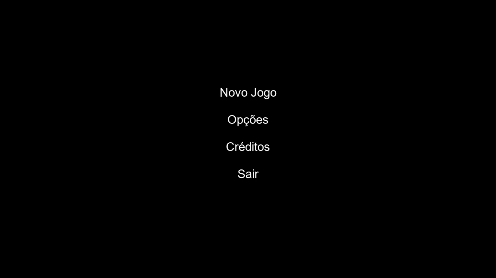
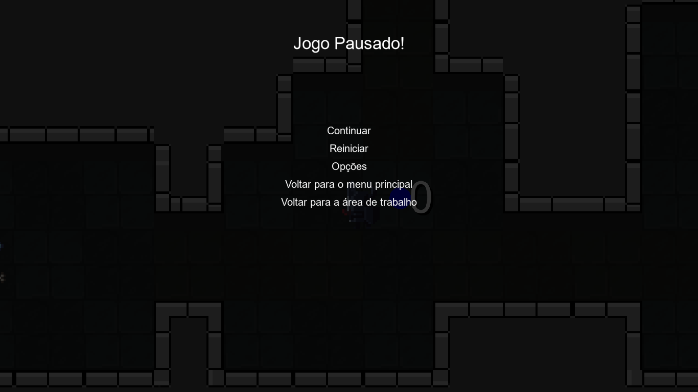

# 🛡️ Ashes of Reverie Songs Of The Fallen

**Resumo**  
*Ashes of Reverie* é um jogo de aventura no estilo Roguelike, com visão top-down, em que o jogador explora masmorras esquecidas pelo tempo em busca dos segredos que elas escondem. Durante essa jornada, ele enfrentará diferentes tipos de inimigos — cada um mais perigoso e inteligente que o outro — até alcançar seu limite.

---

## 🎯 Objetivo  

O principal objetivo deste projeto é demonstrar como diversos conceitos da ciência da computação estão presentes no nosso cotidiano, especialmente nos jogos digitais, muitas vezes sem que percebamos. A proposta do jogo é ilustrar, de forma prática e interativa, como estruturas de dados e a teoria dos grafos desempenham um papel fundamental em mecânicas como geração de mapas, propagação de alertas e comportamento de inteligência artificial.

---

## 👨‍💻 Tecnologias Utilizadas

GameMaker Studio 2 (GML - GameMaker Language).  
Piskel.  
BFS (Busca em Largura).

---

## 📁 Estrutura do Projeto
```text
📦 GameProject
├── 📁 objects
│    ├── 📁 obj_player
│    ├── 📁 obj_enemy1
│    ├── 📁 obj_hitbox
│    └── 📁 obj_colisao
├── 📁 options
│    ├── 📁 main
│    ├── 📁 operagx
│    └── 📁 windows
├── 📁 rooms
│    └── 📄 room_1
├── 📁 scripts
│    ├── 📁 create_map
│    │   └── ...(scripts relacionados à geração do mapa)
│    ├── 📄 enemy1_states
│    ├── 📄 player_states
│    ├── 📄 propagar_alerta_bfs
│    └── 📄 tilemap_autotile
├── 📁 sprites
│    ├── 📁 enemy1_sprites
│    │   └── ...(sprites utilizados para o inimigo)
│    ├── 📁 player_sprites
│    │   └── ...(sprites utilizados para o player)
│    ├── 📄 spr_colisao
│    ├── 📄 spr_tileset
│    └── 📄 spr_tileset_chao
├── 📁 tilesets
│    ├── 📄 ts_chao
│    └── 📄 ts_tileset
├── 📄 GameProject.ypp ← Arquivo principal do projeto do GameMaker Studio
└── 📄 README.md
```

## ⚙️ Como Executar

### ✅ Rodando Localmente

```
  1. baixar o arquivo executável "GameProject.exe"
  2. instalar o jogo;
  3. abrir o jogo através do atalho;
```

---

## 📸 Demonstrações

Inclua aqui prints, gifs ou vídeos mostrando a interface ou o funcionamento do sistema:

- Tela inicial
  ;
- Jogo em execução
  ;
- Tela de pausa
  ;
---

## 👥 Equipe

| Nome | GitHub |
|------|--------|
| Lucas Marques Ribeiro | [@lucasmri23](https://github.com/lucasmri23) |
| Cesar Augusto Salles Marcondes | [@CesarSalles01](https://github.com/CesarSalles01) |
| Felipe Pereira Firmino | [felipeaj21](https://github.com/felipeaj21) |

---

## 🧠 Disciplinas Envolvidas

- Teoria dos Grafos

---

## 🏫 Informações Acadêmicas

- Universidade: **Centro Universitário Braz Cubas**
- Curso: **Ciência da Computação**
- Semestre: 5º
- Período: Noite
- Professora orientadora: **Dra. Andréa Ono Sakai**
- Evento: **Mostra de Tecnologia 1º Semestre de 2025**
- Local: Laboratório 12
- Datas: 05 e 06 de junho de 2025

---

## 📄 Licença

MIT License — sinta-se à vontade para utilizar, estudar e adaptar este projeto.

---
